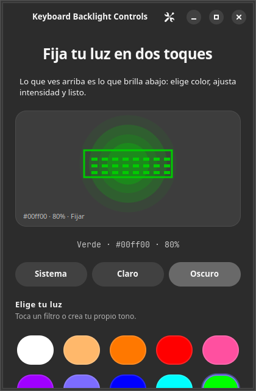
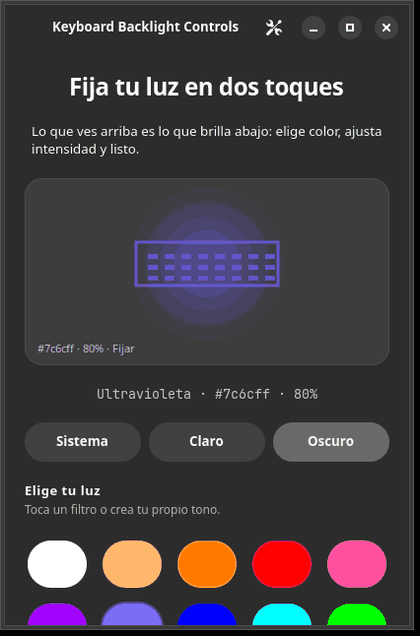

# Keyboard Backlight Controls (`keybackcon`)

Fija la luz de tu teclado **AERO X16** en dos toques: elige color, ajusta
intensidad y listo. Desde terminal o con mesa de luz gráfica, todo en castellano.

  
  

La mesa de luz vive también en la **bandeja del sistema**
(`keybackcon-gui --tray`) y sigue el tema claro/oscuro de tu escritorio.

## Empieza en 3 pasos

1. Instala el `.deb` (ver abajo; en Arch: `yay -S keybackcon`).
2. Fija un color: `keybackcon set ff7800`.
3. Abre la mesa de luz: `keybackcon-gui`.

## Instalación

1. **Ubuntu/Debian (recomendado, `.deb`):** descarga el `.deb` de cada
   [release](https://github.com/Iniciativas-Alexendros/keybackcon/releases)
   e instala con `sudo apt install ./keybackcon_X.Y.Z-1_amd64.deb`
   (binario, GUI, icono, regla udev y unidades de usuario).
2. **Arch Linux (AUR):** `yay -S keybackcon` (o `paru -S keybackcon`).
3. **Script local (`~/.local`):** `./scripts/install.sh`
   (pide sudo una vez para la regla udev).

Cada release trae además el tarball `keybackcon-vX.Y.Z-linux-x86_64.tar.gz`,
`SHA256SUMS` y SBOM CycloneDX.

## Uso

| Comando | Efecto |
|---|---|
| `keybackcon set ff7800` | Fija color (hex, `#hex` o nombre: red, blue, orange…) |
| `keybackcon brightness 60` | Ajusta intensidad (o `+10` / `-10`) |
| `keybackcon animation breathe` | Anima (`breathe` o `rainbow`); `stop` la para |
| `keybackcon off` | Apaga (conserva tu color) |
| `keybackcon restore` | Reaplica tu color guardado (p. ej. al iniciar sesión) |
| `keybackcon info` | Muestra dispositivo y estado |
| `keybackcon-gui --tray` | Mesa de luz (solo bandeja con `--tray`) |

Atajos de la GUI: `Ctrl+1…9` cambia de filtro, `+`/`−` ajusta intensidad.

## Cómo funciona

- Habla directamente con el teclado por USB: sin demonios ni servicios en medio.
- Tu color y brillo se guardan y sobreviven a reinicios y animaciones.
- Solo hay una animación a la vez: cambiar el color la detiene antes.

Detalle técnico (HID LampArray, informes, estado): [`docs/PROTOCOL.md`](docs/PROTOCOL.md),
diseño en [`docs/ARCHITECTURE.md`](docs/ARCHITECTURE.md) y decisiones en [`docs/DECISIONS.md`](docs/DECISIONS.md).

## Problemas típicos

| Síntoma | Qué hacer |
|---|---|
| No encuentra el teclado | Revisa la conexión y prueba `keybackcon info` |
| Permiso denegado en `/dev/hidraw*` | `sudo udevadm trigger` y **vuelve a iniciar sesión** |
| La animación no para | `keybackcon stop` |

## Desarrollo

¿Quieres compilar o contribuir? Todo está en [`docs/DEVELOPMENT.md`](docs/DEVELOPMENT.md).
Índice de documentos: [`docs/INDEX.md`](docs/INDEX.md).

Licencia MIT — ver [`LICENSE`](LICENSE).
